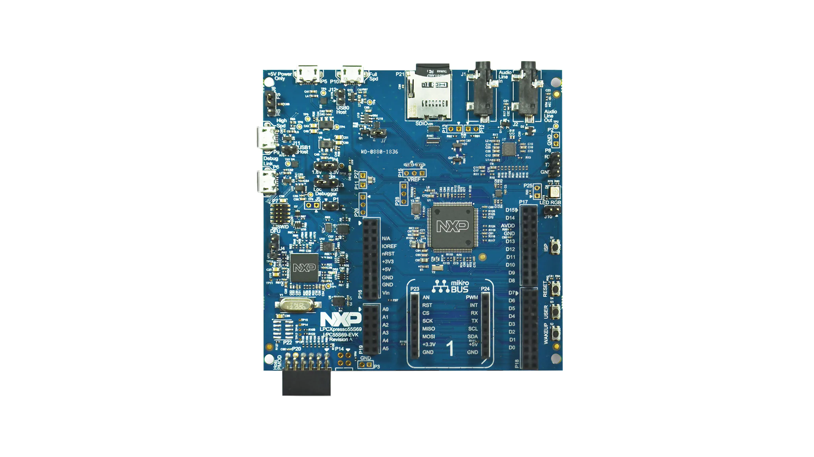

# PoorRTOS

built for : https://www.nxp.com/design/development-boards/lpcxpresso-boards/lpcxpresso55s69-development-board:LPC55S69-EVK

This project was built during  practicals sessions taught by M. Boucharé at [ENIB](https://enib.fr). 

Most of the interestings parts are located in `src/source`, `src/kernel`. The files `src/devices/target.[c|h]`, `src/startup/svc.s`  and `src/devices/vfs.[c|h]` are also worth looking at.